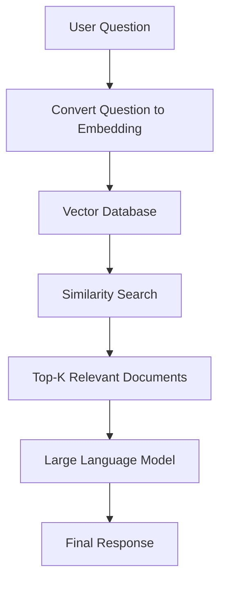
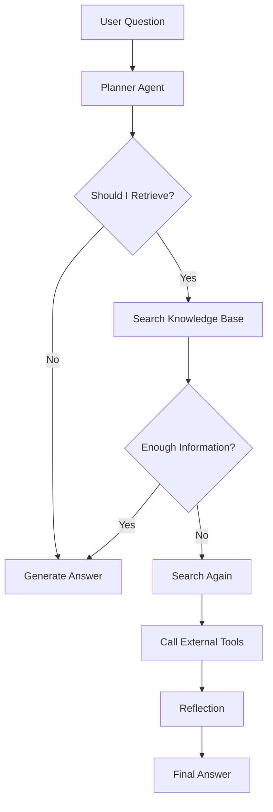
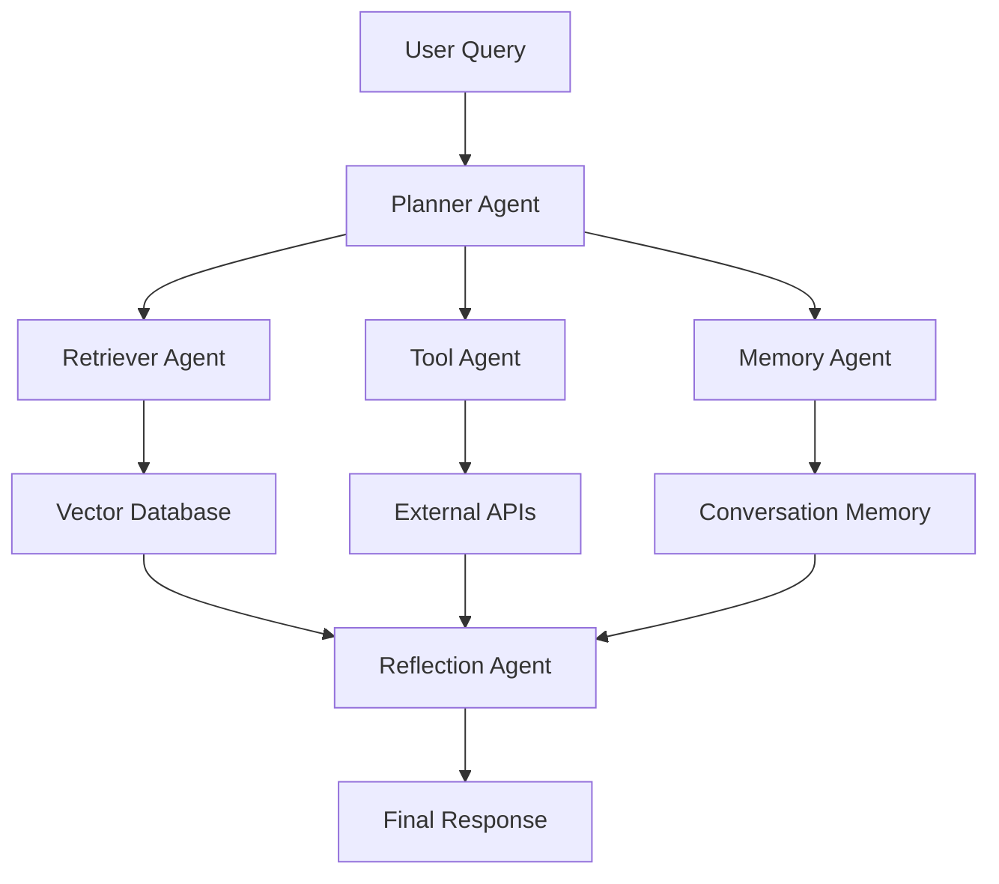

...
# Agentic RAG Explained: Building AI Systems That Think Before They Retrieve

> *Traditional RAG retrieves information. Agentic RAG decides **how**, **when**, and **what** to retrieve before answering.*

---

# Introduction

Large Language Models (LLMs) like GPT, Llama, and Claude have revolutionized how we interact with AI. They can generate human-like responses, write code, summarize documents, and even solve complex problems. However, they all share one significant limitation: **their knowledge is limited to what they were trained on**.

Imagine asking an LLM:

> **"What were the sales numbers from our company's latest quarterly report?"**

The model has no way of knowing because that information isn't part of its training data.

To overcome this limitation, **Retrieval-Augmented Generation (RAG)** was introduced. Instead of relying solely on its internal knowledge, the LLM retrieves relevant documents from an external knowledge base before generating a response.

This was a major breakthrough.

But as AI applications became more sophisticated, developers encountered a new challenge.

What happens when retrieving documents once isn't enough?

What if the AI needs to:

- Search multiple sources
- Decide whether retrieval is even necessary
- Use external tools
- Verify its own answer
- Ask follow-up questions internally before responding

This is where **Agentic RAG** comes into the picture.

Rather than simply retrieving information and answering, Agentic RAG introduces **reasoning, planning, tool usage, memory, and reflection** into the retrieval process, making AI systems far more intelligent and autonomous.

In this article, we'll explore what Agentic RAG is, why it matters, how it works, and why it's becoming the foundation of next-generation AI applications.

---

# Understanding Traditional RAG

Before diving into Agentic RAG, it's important to understand the foundation it builds upon.

Retrieval-Augmented Generation (RAG) combines two powerful ideas:

- Information Retrieval
- Language Generation

Instead of expecting an LLM to remember everything, RAG retrieves relevant information from an external knowledge source and provides it to the model as context.

The workflow looks like this:



For example, imagine you're building an internal chatbot for your company.

A user asks:

> **"What is our leave policy during probation?"**

Instead of relying on the LLM's memory:

1. The question is converted into a vector embedding.
2. A vector database (such as Chroma or FAISS) finds the most similar HR policy documents.
3. Those documents are passed to the LLM.
4. The LLM generates an answer based on the retrieved information.

This approach significantly reduces hallucinations and allows the AI to answer questions using **up-to-date, domain-specific knowledge**.

---

# Why Traditional RAG Falls Short

Traditional RAG works exceptionally well for many scenarios, but it assumes every question follows a simple pattern:

> **Retrieve → Generate → Answer**

Unfortunately, real-world problems are rarely that simple.

Consider this question:

> **"Why is my FastAPI application returning a 502 error after deploying to Kubernetes?"**

A basic RAG pipeline retrieves documents related to:

- FastAPI
- Kubernetes
- 502 Errors

The LLM generates an answer using those documents.

But is that enough?

Probably not.

A human engineer would naturally investigate further:

- Is the Pod running?
- Are the readiness probes failing?
- What do the application logs say?
- Is the Service configured correctly?
- Is the Ingress routing traffic properly?
- Has the deployment recently changed?

Notice something interesting.

A human **doesn't immediately search for documents**.

They first **think**.

Then they decide:

> "I should inspect the logs."

After reading the logs:

> "Now I should check the deployment."

Then:

> "The issue might actually be in the Service configuration."

Finally:

> "Let me compare it with the previous deployment."

This is **multi-step reasoning**.

Traditional RAG cannot perform this type of decision-making on its own.

---

# The Limitations of Traditional RAG

Traditional RAG struggles in several important areas.

## 1. One-Shot Retrieval

Most systems retrieve documents only once.

If the retrieved information is incomplete, the model still tries to answer.

---

## 2. No Planning

The system cannot decide:

- Should I retrieve more documents?
- Should I use another knowledge source?
- Should I call an external tool?

It simply retrieves once and responds.

---

## 3. No Tool Usage

Suppose a user asks:

> **"How many active users logged in today?"**

The answer isn't stored in documents.

It requires querying a database.

Traditional RAG cannot decide to perform that action.

---

## 4. No Reflection

Humans often verify their answers before responding.

Traditional RAG doesn't.

If the retrieved context is insufficient, the response quality suffers.

---

## 5. No Memory

Every request starts from scratch.

The system doesn't remember previous searches, earlier reasoning, or past interactions unless memory is added separately.

---

# Enter Agentic RAG

Agentic RAG takes the core idea of Retrieval-Augmented Generation and enhances it with **agentic behavior**.

Instead of following a fixed pipeline, an intelligent **agent** decides what should happen next.

Rather than simply answering questions, the system begins to reason about the problem.

Think of it like the difference between a GPS and an experienced driver.

A GPS follows a predefined route.

An experienced driver notices traffic, road closures, weather conditions, and chooses a better path.

Agentic RAG behaves like that experienced driver.

Instead of:

```text
Question
    │
Retrieve
    │
Answer
```

it becomes:



The key difference is that the system is **making decisions**, not just executing a fixed sequence of steps.

---

# What Makes an AI "Agent"?

An AI agent is more than an LLM.

It combines reasoning with the ability to take actions.

Most Agentic RAG systems include capabilities such as:

- Planning the next step
- Retrieving information when needed
- Choosing between multiple tools
- Remembering previous context
- Evaluating whether the answer is good enough
- Repeating the process if necessary

This transforms a passive chatbot into an active problem solver.

---

# Core Components of Agentic RAG

A typical Agentic RAG system is composed of several collaborating components.



Let's briefly look at what each component does.

## Planner Agent

The planner is the decision-maker.

It analyzes the user's request and determines the sequence of actions needed to answer it.

Sometimes that means retrieving documents.

Other times it may skip retrieval entirely and answer directly.

---

## Retriever Agent

This agent searches a vector database or knowledge base for relevant information.

Unlike traditional RAG, it can retrieve multiple times if the planner determines more context is needed.

---

## Tool Agent

Not every answer exists in documents.

The Tool Agent can:

- Call APIs
- Execute SQL queries
- Read files
- Run Python code
- Interact with external systems

This allows the AI to gather real-time information instead of relying solely on stored documents.

---

## Memory Agent

The Memory Agent keeps track of previous interactions.

Instead of treating every request as brand new, it maintains context across multiple conversations or reasoning steps.

---

## Reflection Agent

Before returning the final answer, the Reflection Agent asks itself:

- Did I answer the user's question?
- Do I need more information?
- Should I retrieve again?
- Is my reasoning complete?

If necessary, it loops back through retrieval or tool usage before generating the final response.

---

# Why Agentic RAG Matters

The biggest shift isn't that Agentic RAG retrieves more information.

It's that **it reasons about the retrieval process itself.**

Instead of assuming one search is enough, it can:

- Plan before searching
- Decide when retrieval is necessary
- Combine multiple knowledge sources
- Use external tools
- Validate its own reasoning
- Iterate until it has enough confidence

This makes Agentic RAG ideal for:

- AI Coding Assistants
- Enterprise Knowledge Systems
- Customer Support Bots
- Research Assistants
- Software Debugging
- Medical AI
- Financial Analysis
- Autonomous AI Agents

---

# Conclusion

Traditional RAG solved one of the biggest limitations of Large Language Models by giving them access to external knowledge. However, it still follows a relatively simple workflow: retrieve relevant documents once and generate an answer.

As AI systems are expected to solve increasingly complex problems, that approach is no longer enough.

**Agentic RAG** represents the next evolution.

Instead of blindly retrieving information, it plans, reasons, decides when to search, chooses the right tools, remembers previous context, and reflects on whether its answer is sufficient before responding.

In other words, it transforms an AI system from a passive information retriever into an intelligent problem solver.

As modern AI applications continue to grow in complexity, Agentic RAG is quickly becoming one of the most important architectural patterns for building reliable, autonomous, and production-ready AI systems.
